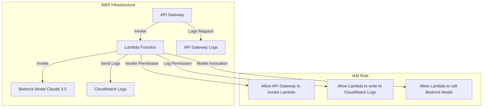

### 다이어그램 구조 설명:

1. **API Gateway**: 클라이언트 요청을 받고 **Lambda 함수**를 호출합니다.
2. **Lambda Function**: Lambda 함수는 **Bedrock Claude 3.5 모델**을 호출하고, **CloudWatch Logs**에 로그를 기록합니다.
3. **IAM Role**: IAM 역할은 API Gateway가 Lambda를 호출할 수 있는 권한을 부여하고, Lambda가 CloudWatch Logs와 Bedrock 모델에 접근할 수 있는 권한을 부여합니다.
4. **CloudWatch Logs**: Lambda 실행 중 발생하는 로그를 기록합니다.
5. **API Gateway Logs**: API Gateway가 요청 및 응답을 기록합니다.