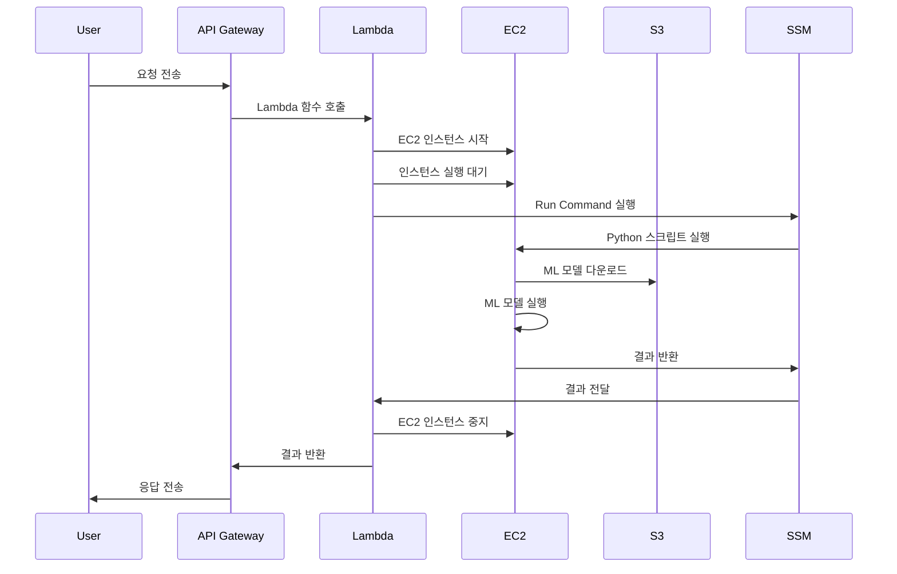

전체 프로세스:

1. 사용자가 API Gateway나 다른 트리거를 통해 Lambda 함수를 호출합니다.
2. Lambda 함수가 EC2 인스턴스를 시작합니다.
3. EC2 인스턴스가 완전히 시작되면, Lambda 함수는 SSM Run Command를 사용해 EC2 인스턴스에서 Python 스크립트를 실행합니다.
4. EC2 인스턴스는 S3에서 ML 모델을 다운로드하고 실행합니다.
5. ML 모델 실행 결과가 Lambda 함수로 반환됩니다.
6. Lambda 함수는 EC2 인스턴스를 중지합니다.
7. 결과가 사용자에게 반환됩니다.

이 프로세스를 시각적으로 나타내면 다음과 같습니다:

이 다이어그램은 전체 프로세스의 흐름을 시각적으로 보여줍니다. 주요 단계는 다음과 같습니다:

1. 사용자가 API Gateway를 통해 요청을 보냅니다.
2. API Gateway가 Lambda 함수를 호출합니다.
3. Lambda 함수가 EC2 인스턴스를 시작하고 실행될 때까지 기다립니다.
4. Lambda 함수가 SSM Run Command를 사용하여 EC2 인스턴스에서 Python 스크립트를 실행합니다.
5. EC2 인스턴스가 S3에서 ML 모델을 다운로드하고 실행합니다.
6. 실행 결과가 SSM을 통해 Lambda 함수로 반환됩니다.
7. Lambda 함수가 EC2 인스턴스를 중지합니다.
8. 결과가 API Gateway를 통해 사용자에게 반환됩니다.

이 아키텍처의 장점:
- 필요할 때만 EC2 인스턴스를 실행하므로 비용 효율적입니다.
- 서버리스 아키텍처(Lambda)와 서버 기반 아키텍처(EC2)의 장점을 결합했습니다.
- S3를 사용하여 ML 모델을 저장하고 관리할 수 있습니다.

단점 및 고려사항:
- EC2 인스턴스 시작 및 중지에 시간이 소요되어 전체 처리 시간이 길어질 수 있습니다.
- Lambda 함수의 최대 실행 시간(15분) 제한으로 인해 긴 작업에는 적합하지 않을 수 있습니다.
- 오류 처리 및 재시도 로직이 필요할 수 있습니다.