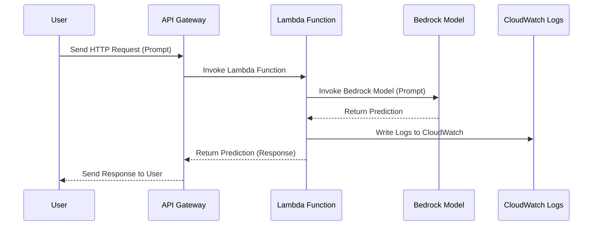

이 시퀀스 다이어그램은 사용자가 API Gateway를 호출하여 AWS Bedrock 모델에 요청을 보내는 과정에서 발생하는 이벤트 순서를 시각적으로 설명합니다.

### 시퀀스 다이어그램 설명:

1. **사용자**가 **API Gateway**에 요청을 보냅니다.
2. **API Gateway**는 **Lambda 함수**를 호출합니다.
3. **Lambda 함수**는 **AWS Bedrock Claude 3.5 모델**에 요청을 보냅니다.
4. **Bedrock 모델**은 예측 결과를 **Lambda 함수**에 반환합니다.
5. **Lambda 함수**는 실행 로그를 **CloudWatch Logs**에 기록합니다.
6. **Lambda 함수**는 **API Gateway**에 예측 결과를 반환합니다.
7. **API Gateway**는 예측 결과를 **사용자**에게 반환합니다.