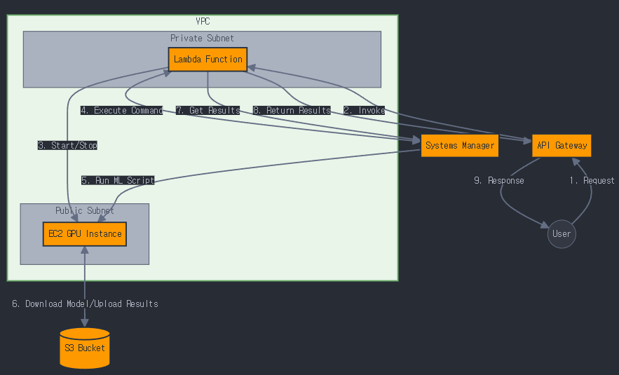

## 단순 아키텍처

## 상세 아키텍처

1. User: HTTPS를 통해 API Gateway로 요청을 보냅니다.

2. API Gateway: 사용자 요청을 받아 Lambda 함수를 호출합니다.

3. Lambda Function: 
   - VPC 내 프라이빗 서브넷에 위치
   - EC2 인스턴스 시작/중지
   - SSM을 통해 EC2에 명령 실행
   - S3와 상호작용하여 데이터 저장/검색
   - CloudWatch에 로그 기록

4. EC2 GPU Instance: 
   - VPC 내 퍼블릭 서브넷에 위치
   - ML 모델 실행
   - S3에서 모델 다운로드 및 결과 업로드
   - CloudWatch에 로그 기록

5. S3 Bucket: ML 모델과 처리 결과를 저장합니다.

6. Systems Manager (SSM): EC2 인스턴스에서 ML 스크립트 실행을 관리합니다.

7. VPC (Virtual Private Cloud):
   - 인터넷 게이트웨이를 통해 외부 연결
   - NAT 게이트웨이를 통해 프라이빗 서브넷의 아웃바운드 트래픽 처리

8. Security Groups: EC2 인스턴스와 Lambda 함수에 대한 인바운드/아웃바운드 트래픽 제어

9. CloudWatch Logs: Lambda와 EC2의 로그를 수집하고 모니터링합니다.

10. IAM Roles: Lambda, EC2, SSM에 필요한 권한을 부여합니다.

프로세스 흐름:
1. 사용자가 API Gateway를 통해 요청을 보냅니다.
2. API Gateway가 Lambda 함수를 호출합니다.
3. Lambda가 EC2 인스턴스를 시작합니다.
4. Lambda가 SSM을 통해 EC2에 명령을 실행합니다.
5. EC2가 S3에서 ML 모델을 다운로드합니다.
6. EC2가 ML 모델을 실행하고 데이터를 처리합니다.
7. 처리 결과를 S3에 업로드합니다.
8. Lambda가 EC2 인스턴스를 중지합니다.
9. 결과가 API Gateway를 통해 사용자에게 반환됩니다.

이 아키텍처의 주요 특징:
- 보안: VPC, 서브넷 분리, 보안 그룹을 통한 네트워크 보안 강화
- 확장성: 서버리스 Lambda와 온디맨드 EC2 인스턴스 조합
- 비용 최적화: 필요할 때만 EC2 GPU 인스턴스 실행
- 모니터링: CloudWatch를 통한 로깅 및 모니터링
- 권한 관리: IAM을 통한 세분화된 권한 제어